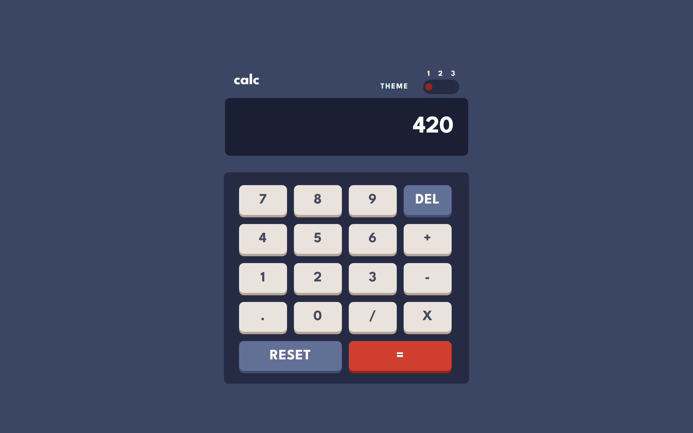
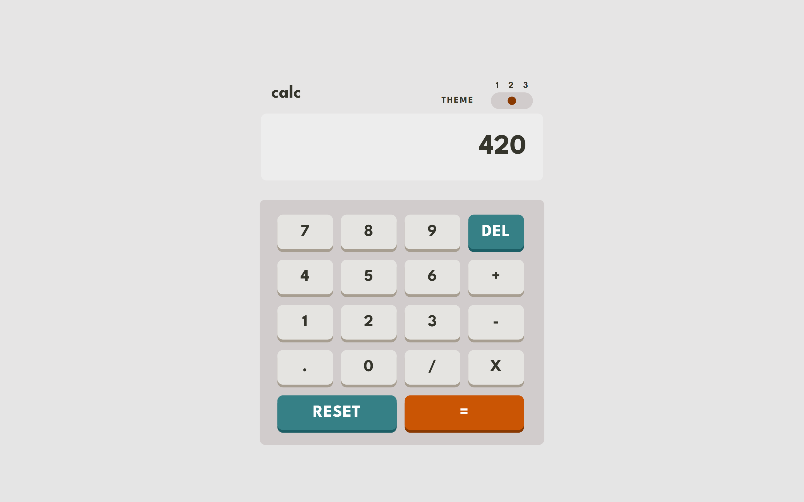
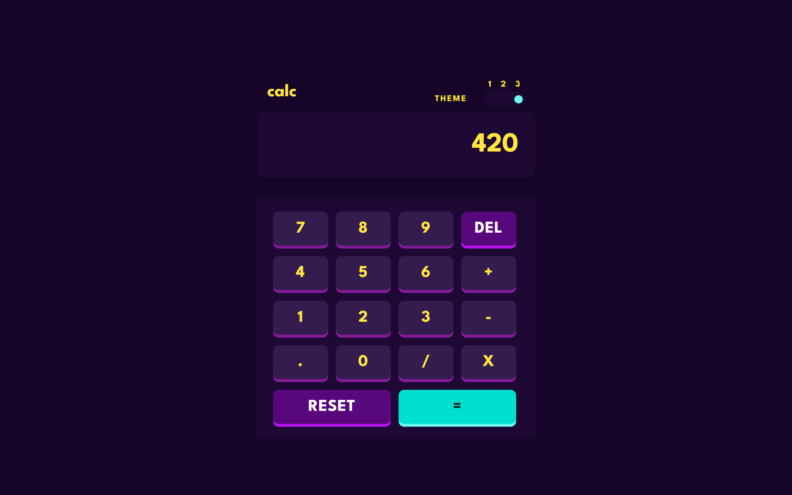
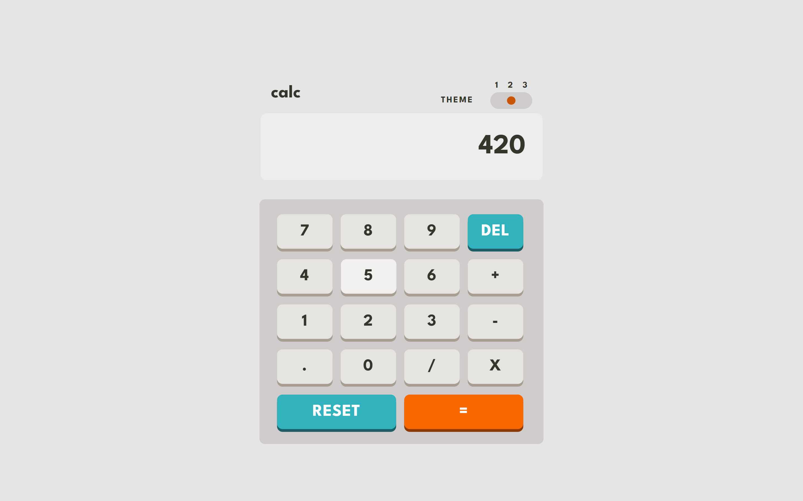
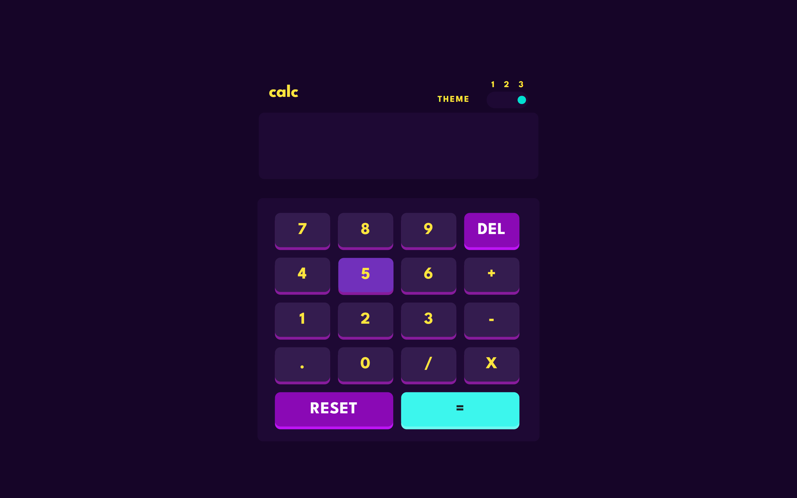

# Frontend Mentor - Calculator app solution

This is a solution to the [Calculator app challenge on Frontend Mentor](https://www.frontendmentor.io/challenges/calculator-app-9lteq5N29). Frontend Mentor challenges help you improve your coding skills by building realistic projects.

## Table of contents

- [The challenge](#the-challenge)
- [Screenshot](#screenshot)
- [Links](#links)
- [Built with](#built-with)
- [Author](#author)

### The challenge

Users should be able to:

- See the size of the elements adjust based on their device's screen size
- Perform mathmatical operations like addition, subtraction, multiplication, and division
- Adjust the color theme based on their preference
- **Bonus**: Have their initial theme preference checked using `prefers-color-scheme` and have any additional changes saved in the browser

### Screenshot

### Links

- Solution URL: [GitHub Solution URL](https://github.com/apodgornyitba/Calculator)
- Live Site URL: [GitHub pages URL](https://apodgornyitba.github.io/Calculator/)

### Built with

- [React](https://reactjs.org/) - JS library
- [Next.js](https://nextjs.org/) - React framework
- [Node.js](https://nodejs.org/) - JS runtime environment

## Author

- Website - [Andres Podgorny](https://github.com/apodgornyitba)
- Frontend Mentor - [@apodgornyitba](https://www.frontendmentor.io/profile/apodgornyitba)
- Twitter - [@PodgornyAndres](https://twitter.com/PodgornyAndres)
